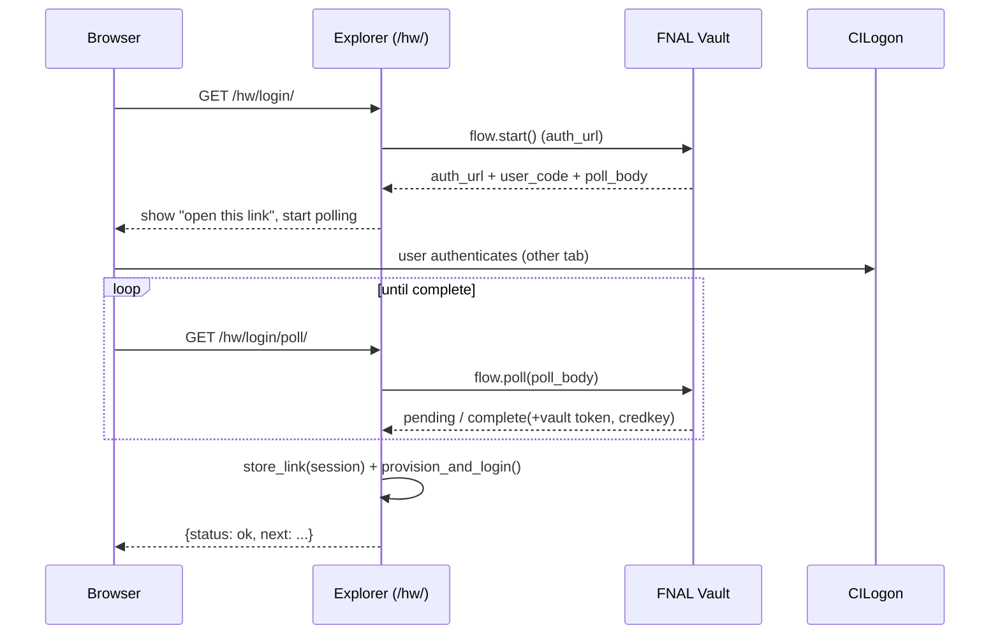
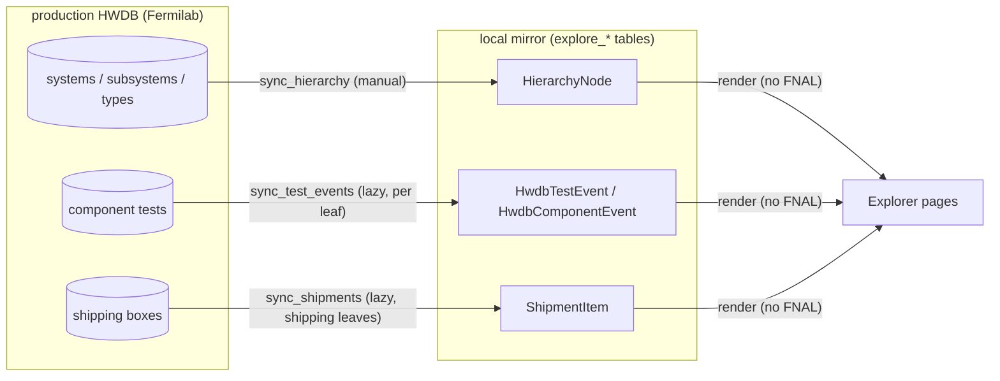
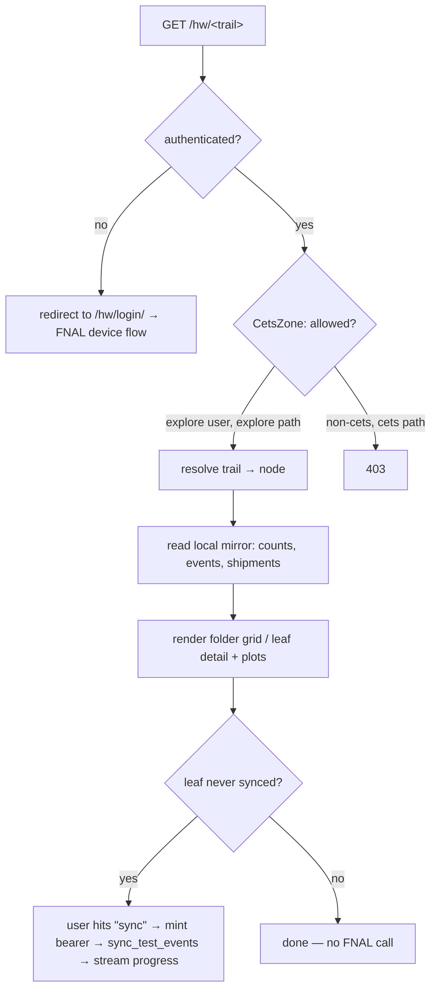

# Tech Note — The DUNE HWDB Explorer (`/hw/`)

**Audience:** engineers new to this part of the codebase.
**Scope:** the `explore` Django app — what it is, how a request flows through
it, and the three pillars that make it work: **FNAL authentication**, the
**local mirror** of production HWDB, and the **curated structure-first
navigation**.

This note is a narrative overview. The authoritative per-decision record lives
in `docs/adr/` — every section below cites the ADR(s) it summarizes. When this
note and the code disagree, the code wins; tell me and I'll fix the note.

---

## 1. What it is

The Explorer is a **standalone, read-only browser for DUNE detector hardware**,
mounted at `/hw/`. It lets anyone with a Fermilab account walk the DUNE hardware
tree (System → Subsystem → Component Type), see how many components exist and
how many tests have been recorded, view per-month activity plots, track shipping
boxes, and drill into an individual part — all without touching the
cold-electronics (CE) QC tooling that the rest of `cets` is built around.

It is its own Django app (`explore/`) with its own chrome and its **own login**:
the FNAL device flow *is* the credential (ADR-0011). It shares one deployment
and one database with the CE app but is otherwise a distinct product.

Two things to hold in mind, because every design choice follows from them:

1. **We never own the data.** The system of record is the production DUNE HWDB
   at Fermilab. The Explorer holds a **disposable local mirror** and rebuilds it
   by re-syncing. Nothing here is precious (ADR-0007).
2. **Rendering is FNAL-free; only *syncing* needs FNAL.** Browsing reads the
   local mirror, so pages are fast and work even without a live FNAL link.
   Talking to HWDB (to refresh the mirror) is the only thing that needs a
   bearer token.

---

## 2. Map of the app

```
explore/
├── auth.py           # FNAL login → Django user; the @fnal_login_required gate
├── middleware.py     # CetsZoneMiddleware — two-zone authorization guard
├── models.py         # the mirror tables (HierarchyNode, *Event, ShipmentItem, sync state)
├── curation.py       # loads curation.yaml — the source of truth for "what's browsable"
├── curation.yaml     # Region → Family → member system ids (a maintained artifact)
├── navigation.py     # URL trail ⇄ node; builds folder cards, breadcrumbs, sidebar tree
├── hierarchy.py      # sync engine: walk HWDB structure → HierarchyNode mirror
├── events.py         # sync engine: per-component-type test/component events
├── shipments.py      # sync engine: shipping boxes → ShipmentItem
├── parts.py          # generic part-detail + assembly-tree fetch (live)
├── queries.py        # chart data off the mirror
├── charts.py         # hierarchy chart: spec/overlay loader, SVG layout + edge routing
├── chart_specs/      # per-chart YAML: semantic spec + generated .layout + hand .mapping
├── views.py          # all HTTP endpoints (login, browse, sync, part, search…)
├── urls.py           # routes, mounted under /hw/
└── management/commands/
    ├── sync_hierarchy.py   # CLI refresh of the structure mirror
    ├── list_systems.py     # audit: HWDB systems vs curation.yaml (drift detector)
    ├── extract_chart.py    # bootstrap a chart spec / regenerate its layout overlay from the PDF
    └── audit_chart_mapping.py  # audit: chart mapping vs spec + mirror (paste-ready candidates)
```

The shared **HWDB gateway** stays in the `hwdb` app and is imported here:
`hwdb/fnal/` (the device flow, token vault, crypto), `hwdb/api_client.py`
(`FnalDbApiClient`), and `hwdb/instance.py` (prod/dev toggle). The Explorer owns
no HTTP-to-Fermilab code of its own — it borrows `hwdb`'s (ADR-0011).

---

## 3. Authentication & authorization

There are two independent mechanisms and it's worth keeping them separate in
your head:

- **Authentication** — *who are you?* Handled by the FNAL device flow.
- **Authorization / zoning** — *what may you touch?* Handled by
  `CetsZoneMiddleware`.

### 3.1 FNAL device flow (the login)

The Explorer's only login is the Fermilab OIDC **device flow**, driven against
`htvaultprod.fnal.gov` (HashiCorp Vault). The protocol lives in
`hwdb/fnal/flow.py` and runs in three composable steps:

1. **`start()`** — POST to Vault's `auth_url`; get back a CILogon URL (+ a
   `user_code`) to show the user, and an opaque `poll_body` to hold onto.
2. **`poll(poll_body)`** — the browser polls (`/hw/login/poll/`) on a timer
   while the user completes CILogon in another tab. Each tick returns
   `pending` / `slow_down` / `complete`.
3. **`complete(auth)`** — on success, extract the **vault token**, its lease
   duration, and the **credkey** (the lowercase Fermilab services username,
   from `metadata.credkey`).

On completion the Explorer does two things (`explore/views.py:login_poll_view`
→ `explore/auth.py`):

- **Stores the link** in the session (`store_link`) — see §3.3.
- **Provisions + logs in a Django user** (`provision_and_login`), because the
  Explorer wants a real logged-in identity, not a session-only one (ADR-0011,
  "Strategy 1").



### 3.2 The `fnal:<credkey>` username namespace (a security decision)

FNAL-provisioned users get the Django username **`fnal:<credkey>`**, *never* the
bare credkey (`explore/auth.py`, ADR-0011). This is deliberate and important:

If we keyed on the bare credkey, a FNAL login whose credkey happened to match an
existing account (e.g. `admin`, or a CE teammate's `cets` account) would resolve
to *that* account — silently handing a FNAL visitor whatever privileges that
account has. The `fnal:` prefix puts FNAL identities in a disjoint namespace.
The colon is rejected by Django's username validator, so no hand-created account
can ever collide with it. FNAL users are auto-provisioned **group-less and
password-less** → explore-only by construction.

CETS staff do *not* use this door — they sign in with their password account
(and, being members of the `cets` group, they also see the Explorer with no
FNAL link needed).

### 3.3 Where the token lives, and for how long

This is the part most people get wrong when they first read it, so in detail:

- The FNAL **vault token** is stored **in the Django session, not on the User**
  (ADR-0001). Reason: `cets` has historically used a shared `guest` login used
  by several people with *different* FNAL identities. A per-User token row would
  let concurrent guests mint bearers as each other. Session scope makes each
  browser session hold its own token.
- It is **AES-GCM encrypted at rest** with a key HKDF-derived from
  `settings.SECRET_KEY` (`hwdb/fnal/crypto.py`). Session data is otherwise
  plaintext in `django_session`, so a raw DB dump alone doesn't yield usable
  Fermilab credentials.
- **Two token lifetimes:**
  - **Vault token** — long-lived (~2-week FNAL lease), the thing stored in the
    session.
  - **Bearer JWT** — short-lived (~10h), what HWDB actually authenticates. It is
    **minted fresh per request** from the vault token and **never cached**
    (ADR-0002, `hwdb/fnal/bearer.py:mint_for`). Within one request the caller
    mints once and reuses it for every HWDB call, so a bulk sync is *1 mint, N
    calls*.

Mint failures split into two surfaces the views branch on:
`FnalLinkRequired` (no/expired/rejected token → re-link fixes it) and
`FnalUnavailable` (Vault unreachable → re-linking won't help).

**Credential isolation guarantee:** every token read goes through
`mint_for(request)`, which reads only *this request's* session. There is no
shared/global bearer cache anywhere in the request path. Different browser
sessions → different encrypted vault tokens → credentials never mix. (The
boundary is the session cookie itself; two people literally sharing one logged-in
browser session share its token, which is inherent, not a bug.)

### 3.4 Two authorization zones (`CetsZoneMiddleware`)

Once a FNAL user is a normal authenticated Django user, the project-wide
`LoginRequiredMiddleware` would happily let them reach every CE/CETS page. One
middleware draws the line (`explore/middleware.py`, ADR-0011):

- **Superusers and `cets`-group members** → see everything (CE + Explorer).
- **Everyone else authenticated** (i.e. FNAL-provisioned explore users) → may
  touch only the explore app, the FNAL flow, logout, admin (which enforces its
  own staff check), and static files. **Every other path returns 403.**

It's **deny-by-default**: anything not explicitly allow-listed counts as the
CETS zone, so a new page added later is never accidentally exposed to
explore-only users. `is_staff` alone does *not* grant CETS access. The 403 page
offers a "sign in with your CETS account" link so a FNAL user who *does* have a
CETS account isn't dead-ended.

Middleware order matters and is set in `cets/settings.py`:
`AuthenticationMiddleware` → `LoginRequiredMiddleware` → `CetsZoneMiddleware`.

---

## 4. The local mirror

### 4.1 Why a mirror at all

Every page you browse reads local tables, not HWDB. This is what makes the
Explorer fast and keeps it working without a FNAL link. The mirror is a
**disposable cache** — never a system of record — so schema changes carry no
precious data and a re-sync rebuilds everything (ADR-0007, ADR-0011).

### 4.2 The tables (`explore/models.py`)

| Model | One row per | Holds | Refreshed by |
|---|---|---|---|
| `HierarchyNode` | System / Subsystem / Component-Type node | the browsable **structure** skeleton + per-leaf counts and sync state | `hierarchy.sync_hierarchy` |
| `HwdbTestEvent` | one test record for one component | `created` date + `test_type.name` — powers the "tests per month" plot | `events.sync_test_events` |
| `HwdbComponentEvent` | one component registration | `created`/`updated` dates + facets (status, manufacturer, institution, creator) — powers "components per month" and breakdown bars | `events.sync_test_events` |
| `ShipmentItem` | one shipping box (latest location only) | current location, in-transit flag, shipped/received dates, content count | `shipments.sync_shipments` |
| `HierarchySyncState` | singleton | last structure-sync timestamp + counts (for the "refreshed 3h ago" line) | `sync_hierarchy` |

Key modeling notes:

- **`HierarchyNode` stores empty nodes too.** A system registered upstream with
  no component types yet is still navigable (ADR-0012). System/Subsystem fields
  are denormalized onto every node so the tree renders without walking parents.
- **`part_type_id` is the join key** across the event tables and encodes the
  path: `D08100100003` = project `D` · system `081` · subsystem `001` ·
  type `00003`.
- The structure sync (`sync_hierarchy`) **preserves** the per-leaf test-sync
  fields (`tests_synced_at`, `n_tests`) across re-syncs, so refreshing the
  skeleton doesn't wipe what individual leaves have already pulled.

### 4.3 How syncing works — three engines, all lazy

Each engine is a **pure generator** that yields plain-text progress lines; a
view wraps a `StreamingHttpResponse` around it so the browser sees live
progress. Reads from HWDB are parallelized (idempotent); ORM writes stay on the
main thread (SQLite-safe). This mirrors the CE dashboard's `sync_family` shape.

1. **Structure — `hierarchy.sync_hierarchy(api)`** (`explore/hierarchy.py`).
   Walks the curated systems (`systems/D` → `subsystems` → `component-types`),
   records a node for every System/Subsystem/Type including empties, and stores
   a true component count per leaf (read cheaply from the paginated `total`, one
   `size=1` request). Fetches run across a 10-worker pool with retries; if **any**
   fetch still fails, the whole run aborts *before* the prune step, so a partial
   walk can never delete good nodes. After a clean walk it prunes nodes that
   disappeared upstream. This is a **manual, infrequent** refresh (button or
   `sync_hierarchy` command).

2. **Events — `events.sync_test_events(base_url, bearer, part_type_id)`**
   (`explore/events.py`). **Lazy and per-type:** triggered on first visit to a
   component-type leaf. Three cost-tiered modes (ADR-0008/0010):
   - `incremental` (default) — fetch only components not yet mirrored.
   - `components` — refresh *detail* for all components (keeps the `updated`
     inventory chart fresh), tests only for new ones.
   - `full` — re-fetch everything.

   For the CE chip families the plot bins on the **physics test date**
   (`test_data["Test Date"]`); other consortia fall back to the HWDB record
   `created` stamp until their datasheet date field is validated
   (`physics_date_field`, ADR-0009/0010).

3. **Shipments — `shipments.sync_shipments(...)`** (`explore/shipments.py`).
   For curated **shipping-type** leaves only (declared in `curation.yaml`).
   Mirrors **only each box's latest location** into `ShipmentItem` — enough to
   render "where is every box now" with zero live calls. The full location
   timeline and a box's manifest are fetched **live** when a user expands a box
   (ADR-0013). `location_id == 0` is HWDB's "In Transit" sentinel.



---

## 5. Curation & navigation

### 5.1 `curation.yaml` — the source of truth for "what's browsable"

The mirror is a faithful copy of HWDB's structure, but HWDB has ~41 top-level
systems, many placeholders or stalled. `curation.yaml` (loaded by
`explore/curation.py`) overlays a human-maintained grouping and decides what's
navigable (ADR-0012):

- **Region → Family → member system ids**, with display names and order.
- Only curated systems are browsed and synced. Systems not in the YAML are
  excluded; families/regions declared-but-not-yet-browsable render **dimmed**
  ("in HWDB · not curated"), so the audit→curate loop has a visible home rather
  than silently hiding work.
- A **family that maps to exactly one HWDB system** flattens that tier (e.g.
  `FD CE` shows its subsystems directly, no repeated name in the path).
- **shipping_types** — the set of component-type ids whose items are shipping
  boxes.

Region/Family are **presentation only** — they come from the YAML and wrap the
mirrored system rows at render time; they are never stored in the mirror
(subsystems/types churn; regions/families don't).

Adding a system to the Explorer is a **deliberate human edit** to this file —
the deny-by-default analogue for content. `list_systems` (management command) is
the periodic **audit**: it reports HWDB systems that aren't curated (and
curated-but-gone), so drift is surfaced, never auto-applied.

### 5.2 Drill-in navigation + synced sidebar (`explore/navigation.py`)

The UX is a **file-explorer-style drill-in**: a breadcrumb + a grid of child
"folder" cards; a component-type leaf opens a detail panel (the two plots + meta
+ a link to the HWDB part). A collapsible **sidebar tree** expands only along
the current path and stays in sync with the body. Both ride **one URL route**,
so they can't drift.

**Deep-linkable URLs** — every node has a stable path (ADR-0012):

```
/hw/<region>/<family>/[<system_id>/]<subsystem_id>/<part_type_id>
```

The `<system_id>` segment is omitted for flattened (single-system) families.
Every segment is a stable HWDB id, so links survive re-syncs and Back/Forward
work. `navigation.resolve(trail)` maps a URL trail to a view spec (crumbs +
child cards or leaf); `node_path(...)` is the inverse. Legacy `/hw/?node=<ptid>`
and old `/explore/*` links permanently redirect.

---

## 6. Request lifecycle (putting it together)

A normal browse of a component type:



The only steps that reach Fermilab are the **login** and an explicit **sync**;
everything else is local.

---

## 7. Operating it

- **Refresh the structure** (after a deploy or when new systems are curated):

  ```bash
  python manage.py sync_hierarchy      # walks curated systems into HierarchyNode
  ```

  Or the "Refresh" button in the UI (`/hw/sync/`). This is seconds; visited
  leaves re-pull their events lazily on next visit.

- **Audit curation drift:**

  ```bash
  python manage.py list_systems        # HWDB systems vs curation.yaml
  ```

- **Add a system/family to the Explorer:** edit `explore/curation.yaml`, then
  `sync_hierarchy`.

- **Deploy** (shared with the rest of `cets`, see the deployment note):
  `git pull && migrate && collectstatic && systemctl restart cets.service`.
  Because the mirror is disposable, a table change just needs a re-sync
  afterwards — no data migration.

- **Recent FNAL logins** (Explorer users are Django users named `fnal:<credkey>`;
  `login()` stamps `last_login`):

  ```bash
  sqlite3 db.sqlite3 \
    "SELECT username, last_login FROM auth_user WHERE username LIKE 'fnal:%' ORDER BY last_login DESC;"
  ```

---

## 8. Design decisions (ADR index)

The Explorer's shape is recorded across these ADRs (in `docs/adr/`). Read in
this order for the full story:

| ADR | Decision |
|---|---|
| 0001 | Session-scoped FNAL linkage, encrypted with a `SECRET_KEY`-derived key |
| 0002 | Mint the HWDB bearer per request, don't cache it |
| 0007 | HWDB-mirrored data lives in its own table — it's a disposable cache |
| 0008 | Skip-known-serials incremental sync |
| 0009 | Mirror test-timestamp fallback (physics date vs record `created`) |
| 0010 | The original FD-VD component dashboard over the HWDB hierarchy |
| 0011 | Extract the Explorer into a standalone app with FNAL login + two zones |
| 0012 | Structure-first, curated explorer with drill-in navigation |
| 0013 | Shipment tracker on shipping-type leaves (latest-location mirror) |
| 0014 | Generic part-detail page |
| 0015 | Assembly tree on the part page |
| 0016 | Hierarchy chart: semantic spec + generated layout overlay + mapping overlay |

---

## 9. Things worth knowing before you change something

- **The mirror is disposable — act like it.** Don't add a "precious" column that
  can't be rebuilt by a re-sync. If state must survive a rebuild, it belongs in
  the CE app, not the mirror (ADR-0007).
- **Rendering must stay FNAL-free.** If you find yourself calling HWDB in a page
  render, you've probably broken the "browse works without a link" property.
  Live calls belong in sync engines or explicit expand actions (e.g. a box
  manifest, a part's assembly tree).
- **Authorization is deny-by-default.** A new view is in the CETS zone unless you
  say otherwise. If it should be reachable by explore-only users, it must live
  under the `explore` app or be added to the middleware allow-list — and think
  about whether that's really what you want.
- **`fnal:` prefix is load-bearing.** Don't "simplify" FNAL usernames to the bare
  credkey; that reopens the privilege-escalation path 0011 closed.
- **Curation is manual on purpose.** Systems don't appear until a human adds them
  to `curation.yaml`. The `list_systems` audit tells you what's drifted; it
  never auto-applies.
