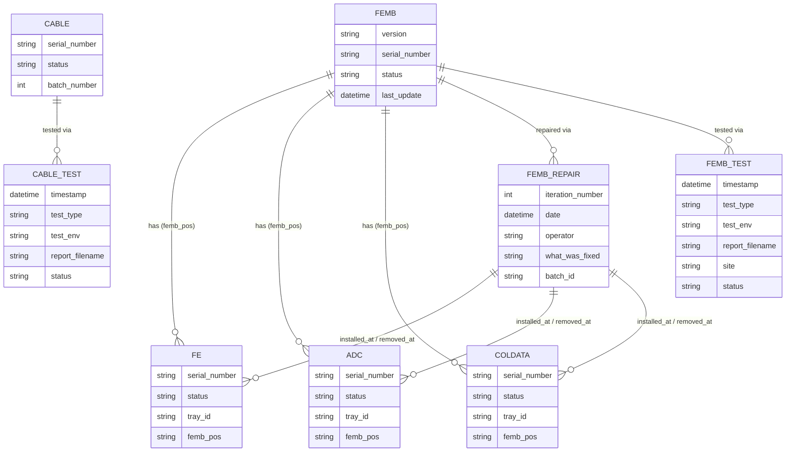
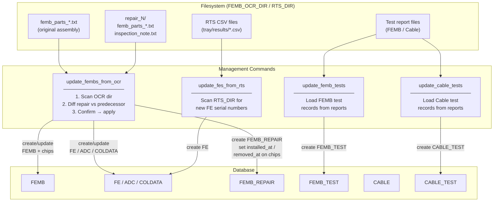
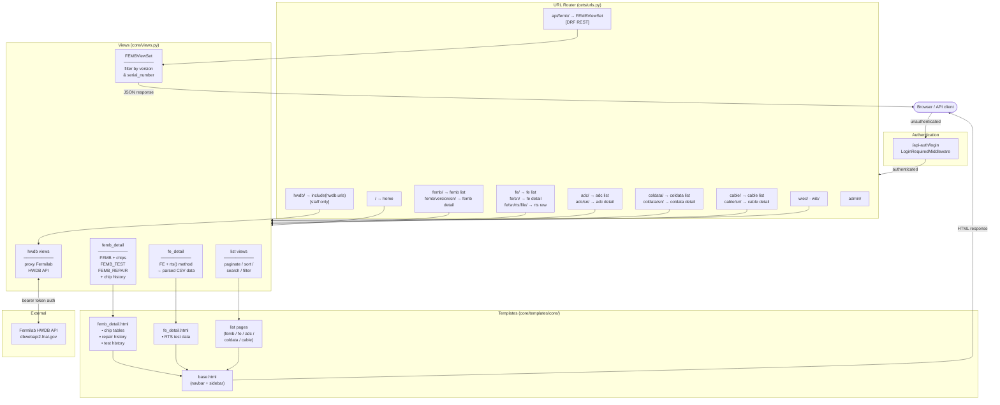

# CETS Flowchart

## Data Model

```mermaid
erDiagram
    FEMB {
        string version
        string serial_number
        string status
        datetime last_update
    }
    FE {
        string serial_number
        string status
        string tray_id
        string femb_pos
    }
    ADC {
        string serial_number
        string status
        string tray_id
        string femb_pos
    }
    COLDATA {
        string serial_number
        string status
        string tray_id
        string femb_pos
    }
    FEMB_REPAIR {
        int iteration_number
        datetime date
        string operator
        string what_was_fixed
        string batch_id
    }
    FEMB_TEST {
        datetime timestamp
        string test_type
        string test_env
        string report_filename
        string site
        string status
    }
    CABLE {
        string serial_number
        string status
        int batch_number
    }
    CABLE_TEST {
        datetime timestamp
        string test_type
        string test_env
        string report_filename
        string status
    }

    FEMB ||--o{ FE : "has (femb_pos)"
    FEMB ||--o{ ADC : "has (femb_pos)"
    FEMB ||--o{ COLDATA : "has (femb_pos)"
    FEMB ||--o{ FEMB_REPAIR : "repaired via"
    FEMB ||--o{ FEMB_TEST : "tested via"
    CABLE ||--o{ CABLE_TEST : "tested via"
    FEMB_REPAIR ||--o{ FE : "installed_at / removed_at"
    FEMB_REPAIR ||--o{ ADC : "installed_at / removed_at"
    FEMB_REPAIR ||--o{ COLDATA : "installed_at / removed_at"
```

---

## Data Ingestion

```mermaid
flowchart TD
    subgraph FS["Filesystem (FEMB_OCR_DIR / RTS_DIR)"]
        OCR["femb_parts_*.txt\n(original assembly)"]
        REPAIR_DIR["repair_N/\nfemb_parts_*.txt\ninspection_note.txt"]
        RTS["RTS CSV files\n(tray/results/*.csv)"]
        TEST_REPORTS["Test report files\n(FEMB / Cable)"]
    end

    subgraph CMD["Management Commands"]
        CMD1["update_fembs_from_ocr\n─────────────────\n1. Scan OCR dir\n2. Diff repair vs predecessor\n3. Confirm → apply"]
        CMD2["update_fes_from_rts\n─────────────────\nScan RTS_DIR for\nnew FE serial numbers"]
        CMD3["update_femb_tests\n─────────────────\nLoad FEMB test\nrecords from reports"]
        CMD4["update_cable_tests\n─────────────────\nLoad Cable test\nrecords from reports"]
    end

    subgraph DB["Database"]
        FEMB_M["FEMB"]
        FE_M["FE / ADC / COLDATA"]
        REPAIR_M["FEMB_REPAIR"]
        FTEST_M["FEMB_TEST"]
        CABLE_M["CABLE"]
        CTEST_M["CABLE_TEST"]
    end

    OCR --> CMD1
    REPAIR_DIR --> CMD1
    CMD1 -->|"create/update\nFEMB + chips"| FEMB_M
    CMD1 -->|"create/update\nFE / ADC / COLDATA"| FE_M
    CMD1 -->|"create FEMB_REPAIR\nset installed_at /\nremoved_at on chips"| REPAIR_M

    RTS --> CMD2
    CMD2 -->|"create FE"| FE_M

    TEST_REPORTS --> CMD3
    CMD3 -->|"create FEMB_TEST"| FTEST_M

    TEST_REPORTS --> CMD4
    CMD4 -->|"create CABLE_TEST"| CTEST_M
```

---

## Web Request Flow

```mermaid
flowchart TD
    USER(["Browser / API client"])

    subgraph AUTH["Authentication"]
        LOGIN["/api-auth/login\nLoginRequiredMiddleware"]
    end

    subgraph URLS["URL Router (cets/urls.py)"]
        U_HOME["/ → home"]
        U_FEMB["femb/ → femb list\nfemb/version/sn/ → femb detail"]
        U_FE["fe/ → fe list\nfe/sn/ → fe detail\nfe/sn/rts/file/ → rts raw"]
        U_ADC["adc/ → adc list\nadc/sn/ → adc detail"]
        U_COL["coldata/ → coldata list\ncoldata/sn/ → coldata detail"]
        U_CABLE["cable/ → cable list\ncable/sn/ → cable detail"]
        U_WIB["wiec/ · wib/"]
        U_HWDB["hwdb/ → include(hwdb.urls)\n[staff only]"]
        U_API["api/femb/ → FEMBViewSet\n[DRF REST]"]
        U_ADMIN["admin/"]
    end

    subgraph VIEWS["Views (core/views.py)"]
        V_FEMBD["femb_detail\n──────────\nFEMB + chips\nFEMB_TEST\nFEMB_REPAIR\n+ chip history"]
        V_FED["fe_detail\n──────────\nFE + rts() method\n→ parsed CSV data"]
        V_LIST["list views\n──────────\npaginate / sort /\nsearch / filter"]
        V_HWDB["hwdb views\n──────────\nproxy Fermilab\nHWDB API"]
        V_API["FEMBViewSet\n──────────\nfilter by version\n& serial_number"]
    end

    subgraph TMPL["Templates (core/templates/core/)"]
        T_BASE["base.html\n(navbar + sidebar)"]
        T_FEMBD["femb_detail.html\n• chip tables\n• repair history\n• test history"]
        T_FED["fe_detail.html\n• RTS test data"]
        T_LIST["list pages\n(femb / fe / adc /\ncoldata / cable)"]
    end

    subgraph EXTAPI["External"]
        HWDB_API["Fermilab HWDB API\ndbwebapi2.fnal.gov"]
    end

    USER -->|"unauthenticated"| LOGIN
    LOGIN -->|"authenticated"| URLS

    U_HOME & U_FEMB & U_FE & U_ADC & U_COL & U_CABLE & U_WIB --> VIEWS
    U_HWDB --> V_HWDB
    U_API --> V_API

    V_FEMBD --> T_FEMBD
    V_FED --> T_FED
    V_LIST --> T_LIST
    T_FEMBD & T_FED & T_LIST --> T_BASE

    V_HWDB <-->|"bearer token auth"| HWDB_API

    T_BASE -->|"HTML response"| USER
    V_API -->|"JSON response"| USER
```
